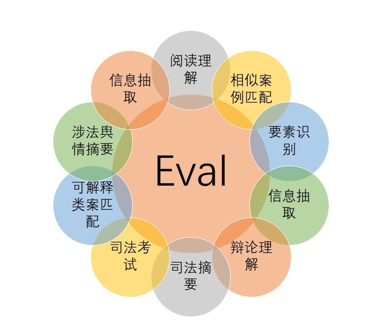
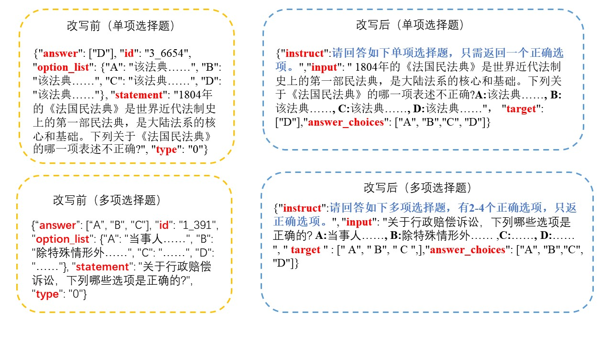
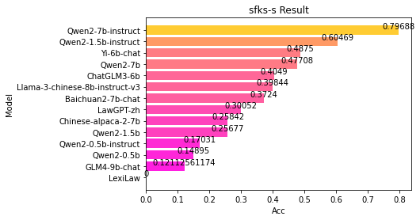
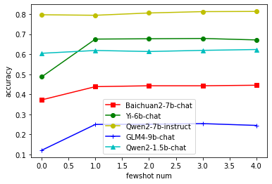

# 法律大模型评测基准Chinese Law LLM Eval

## 评测基准介绍
我们一共设置了11个评估任务，分别是：司法考试，法律要素识别，法律事件监测，法律信息抽取，法律摘要，涉法舆情摘要，法律阅读理解，法律辩论理解，相似类案匹配，可解释类案匹配。这些评估任务全部来自china AI and Law Challenge，该竞赛是国际上最大规模的法律文本智能竞赛。

 

#### 我们统计了这10个任务上的带有标签的样本数量和文本平均长度，如表所示。

|序号|任务	|数量|文本平均长度|其他|
|-----|-----|-----|-----|-----|
|1|	司法考试单选	|10693	|181.695|无	|
|0	|司法考试多选	|10379	|188.498|无	 |
|2	|信息抽取|	2348|	169.166 | Avg entity num: 7.718 Avg relation num:1.514|
|3	|事件监测|	5301|	493.7183 |	Avg mention num：11.81|
|4	|要素识别(婚姻)	|15700|	55.1006 |	Avg label num:1.782|
|5	|相似案例匹配|	8138	|2086.485|	无	|
|6	|可解释类案匹配	|3000	|2331.382|	无	|
|7|	司法摘要	|21991	|212.4278|  	Summary avg len:59.510|
|8	|涉法舆情摘要|	5750	|1788.1003  |	Summary avg len: 139.8916|
|9|	阅读理解	|4200	|710.801	|无	|
|10|	辩论理解|	4183|	514.593|无	|

我们将11种不同的法律NLP任务全部转化为基于提示的语言生成任务，使其符合生成式LLM的输入和输出格式，形成首个中文法律场景的LLM评测基准。

 

## 评测
我们分别在各种通用大模型和法律垂直大模型上进行了zeroshot评测，在部分通用大模型上进行了fewshot评测。

## 评测结果
各模型在CAIL2023司法考试单项选择题任务中Zewshot效果如下：

 

各模型在CAIL2023司法考试单项选择题任务中Fewshot效果如下：

 

